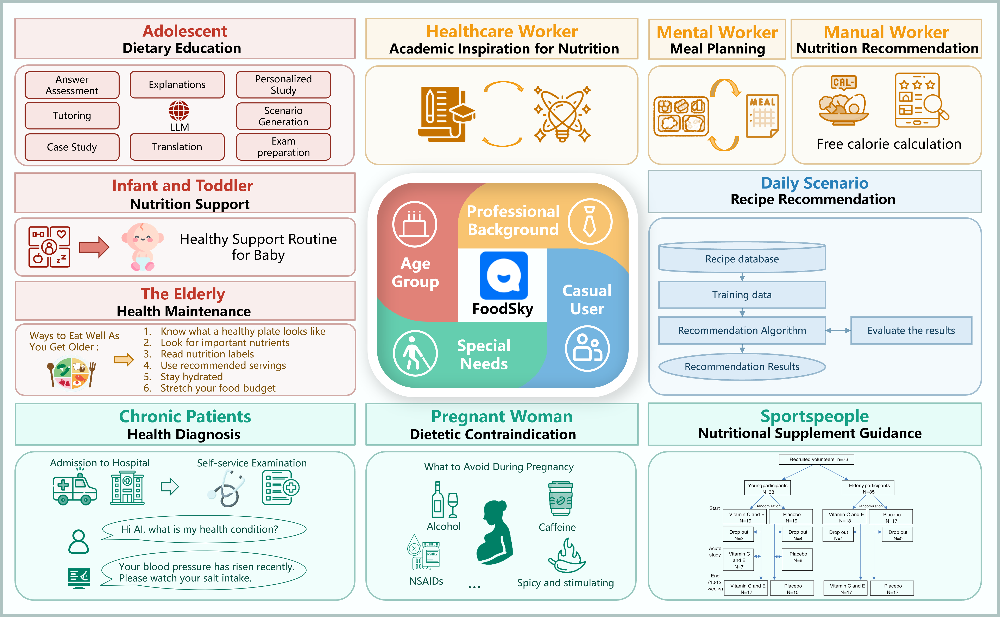

# FoodSky: A Food-oriented Large Language Model Can Pass the Chef and Dietetic Examination

<p align="left">
  <a href="http://123.57.42.89/FoodComputing__Home.html"><b>HomePage</b></a> |
  <a href="https://arxiv.org/abs/2404.16006"><b>arXiv</b></a> |
  <a href="http://222.92.101.211:8200/\#/home"><b>Demo</b></a> |
  <a href="#🖊️-citation"><b>Citation</b></a> <br>
</p>

This repository is the official implementation of [FoodSky](https://arxiv.org/abs/2406.10261). 

> [FoodSky: A Food-oriented Large Language Model Can Pass the Chef and Dietetic Examination](https://arxiv.org/abs/2406.10261)  
> Pengfei Zhou, Weiqing Min<sup>\*</sup>, Chaoran Fu, Ying Jin, Mingyu Huang, Xiangyang Li, Shuhuan Mei, and Shuqiang Jiang<sup>\*</sup>

> <sup>\*</sup> Correponding authors. 

## Introduction
FoodSky is a foundamental LLM specifically designed for the world of food, marking a significant step forward in food computing. As the first Chinese LLM built just for food-related topics, FoodSky uses a vast collection of food data called FoodEarth, which includes everything from recipes to nutritional information, sourced from trusted books and websites. This model isn't just about handling huge amounts of data—it’s smart in understanding and discussing food like a professional. Whether it's passing chefs' exams or providing diet advice, FoodSky shows impressive skills, making it a reliable resource for anyone in the food industry, from chefs to dietitians. Its aim is to make working with food more creative and healthy, helping users across various scenarios with accurate and culturally aware advice. This tool is set to change how we interact with food information, blending detailed food knowledge with cutting-edge technology to better serve food enthusiasts and professionals alike.


## 🚀 TODO List

- [X] Release the test sets and test code.
- [ ] Release the inference code and models.
- [ ] Release the training code.
- [ ] Release a version of FoodEarth dataset.
- [ ] Release a bilingual version of FoodSky and FoodEarth.

## 🖊️ Citation 
If you feel FoodSky insteresting, feel free to use the following BibTeX entry to cite our paper. Thanks!
```
@misc{zhou2024foodskyfoodorientedlargelanguage,
      title={FoodSky: A Food-oriented Large Language Model that Passes the Chef and Dietetic Examination}, 
      author={Pengfei Zhou and Weiqing Min and Chaoran Fu and Ying Jin and Mingyu Huang and Xiangyang Li and Shuhuan Mei and Shuqiang Jiang},
      year={2024},
      eprint={2406.10261},
      archivePrefix={arXiv},
      primaryClass={cs.CL},
      url={https://arxiv.org/abs/2406.10261}, 
}
```