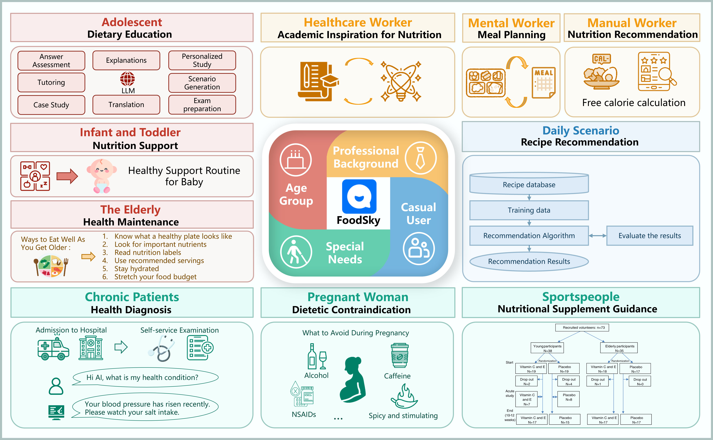

# FoodSky: A Food-oriented Large Language Model that Passes the Chef and Dietetic Examination

<p align="left">
  <a href="http://123.57.42.89/FoodComputing__Home.html"><b>HomePage</b></a> |
  <a href="https://www.cell.com/patterns/fulltext/S2666-3899(25)00082-0"><b>arXiv</b></a> |
  <a href="http://222.92.101.211:8200/\#/home"><b>Demo</b></a> |
  <a href="https://github.com/LanceZPF/FoodSky/blob/main/README.md#%EF%B8%8F-citation"><b>Citation</b></a> <br>
</p>

This repository is the official implementation of [FoodSky](https://www.cell.com/patterns/fulltext/S2666-3899(25)00082-0). 

> [FoodSky: A Food-oriented Large Language Model that Passes the Chef and Dietetic Examination](https://arxiv.org/abs/2406.10261)  
> Pengfei Zhou, Weiqing Min<sup>\*</sup>, Chaoran Fu, Ying Jin, Mingyu Huang, Xiangyang Li, Shuhuan Mei, and Shuqiang Jiang<sup>\*</sup>

> <sup>\*</sup> Correponding authors. 

## Introduction
FoodSky is a fundamental LLM specifically designed for the world of food, marking a significant step forward in food computing. As the first Chinese LLM built just for food-related topics, FoodSky uses a vast collection of food data called FoodEarth, which includes everything from recipes to nutritional information, sourced from trusted books and websites. This model isn't just about handling huge amounts of data—it’s smart in understanding and discussing food like a professional. Whether it's passing chefs' exams or providing diet advice, FoodSky shows impressive skills, making it a reliable resource for anyone in the food industry, from chefs to dietitians. Its aim is to make working with food more creative and healthy, helping users across various scenarios with accurate and culturally aware advice. This tool is set to change how we interact with food information, blending detailed food knowledge with cutting-edge technology to better serve food enthusiasts and professionals alike.


## 🚀 Quick Start Guide
Please refer to [Quick Start Guide](QuickStart.md) for detailed instructions on evaluation, training, and other resources.

### Evaluation
- **NLP Metrics**: For BLEU, GLEU and ROUGE evaluation, check the `inference_nlp` directory. Example usage in `inference_nlp/all_test.sh`.
- **CDE Testing**: Code execution evaluation is available in `test/cde-eval/test.sh`.
- **GPT Evaluations**: GPT model evaluation examples can be found in `test/gpt-eval`.

### Training
Refer to `train/train_scripts/README.md` for detailed training instructions covering:
- Resource optimization (Full-tuning, LoRA, QLoRA)
- Practical tricks (FlashAttention-2, RoPE scaling, etc.)
- Experiment monitoring tools

## 🎯 TODO List

- [X] Release the test data and test code.
- [X] Release the inference code.
- [X] Release the training code and models.
- [x] Release a version of FoodEarth dataset.
- [ ] Release a bilingual version of FoodSky and FoodEarth.

## 📞 Contact

We provide the FoodSky models and FoodEarth dataset in [Zenodo](https://zenodo.org/records/14892842). To prevent server overload, our [demo system](http://222.92.101.211:8200/\#/home) requires authentication. You can try the experience account using username: test, password: 123456. If you are interested in further accessing our work, please contact us through the following channels to request credentials:

- 📧 Email: [zpf4wp@outlook.com](mailto:zpf4wp@outlook.com)
- 🌐 Homepage: [http://123.57.42.89/FoodComputing__Home.html](http://123.57.42.89/FoodComputing__Home.html)

## 🖊️ Citation 
If you feel FoodSky insteresting, feel free to use the following BibTeX entry to cite our paper. Thanks!
```
@misc{zhou2024foodskyfoodorientedlargelanguage,
      title={FoodSky: A Food-oriented Large Language Model that Passes the Chef and Dietetic Examination}, 
      author={Pengfei Zhou and Weiqing Min and Chaoran Fu and Ying Jin and Mingyu Huang and Xiangyang Li and Shuhuan Mei and Shuqiang Jiang},
      year={2024},
      eprint={2406.10261},
      archivePrefix={arXiv},
      primaryClass={cs.CL},
      url={https://arxiv.org/abs/2406.10261}, 
}
```
